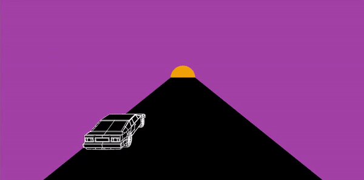

# Fear-and-Loathing-in-Processing
### Creando Interfaces de Usuario - Práctica 6

## Introducción
Se pide proponer un prototipo que combine de salida gráfica e interacción en respuesta a una captura de vídeo. Para ello se propone un pequeño juego al estilo endless runner, como podría ser el juego del T-Rex ofrecido por el navegador Chrome cuando el usuario no tiene conexión a internet, solo que con una estética más synthwave.

## Controles y detección de caras
Para el control del vehículo se emplea el detector de caras de Cam Viola, dado que no se necesita una alta precisión, es más, la baja precisión es un componente interesante del gameplay. 

Dividimos la imagen captada por la cámara en 3 partes, siendo la parte del centro neutra. Cuando el usuario sitúa su cara en los extremos se activan las flags de movimiento hacia la izquierda o la derecha, las cuales provocan el desplazamiento del vehículo cuando este se actualiza.

## Escena
Para el escenario se ha empleado el ruido de Perlin para crear un terreno semejante a un desierto con pequeñas dunas y montañas en el horizonte.

# Aviso: el juego aún se encuentra en desarrollo
